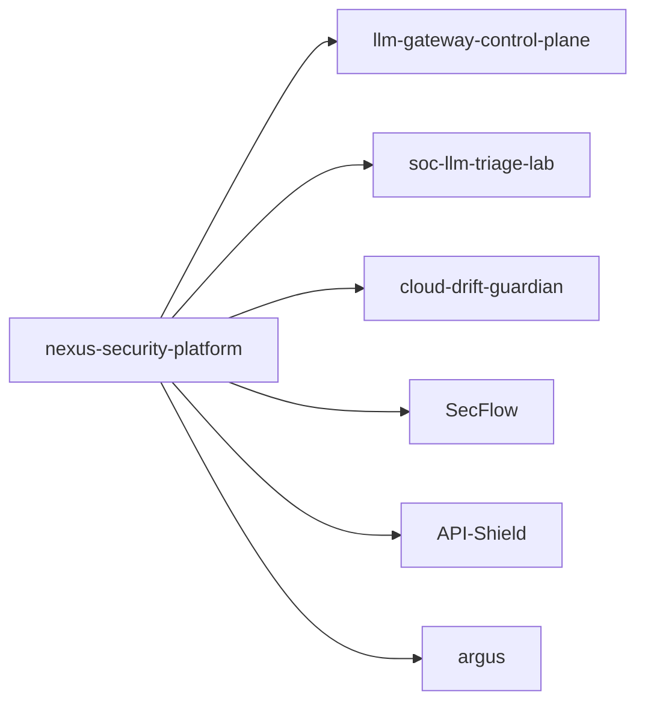

<h1 align="center">Ruslan T. (WaiperOK)</h1>

Security Engineering | AI Security Platforms | Detection & Response Tooling

  
  
  

## Flagship Projects

| Project | Stack | Focus |
|---|---|---|
| [nexus-security-platform](https://github.com/WaiperOK/nexus-security-platform) | Meta | Portfolio hub, architecture map, roadmap |
| [llm-gateway-control-plane](https://github.com/WaiperOK/llm-gateway-control-plane) | Go | LLM routing, policy enforcement, budget and audit controls |
| [soc-llm-triage-lab](https://github.com/WaiperOK/soc-llm-triage-lab) | Python | SOC incident triage, explainable scoring, playbook retrieval |
| [cloud-drift-guardian](https://github.com/WaiperOK/cloud-drift-guardian) | Rust | Desired-vs-actual cloud drift detection with risk scoring |
| [SecFlow](https://github.com/WaiperOK/SecFlow) | Python | Multi-scanner DevSecOps orchestration framework |
| [API-Shield](https://github.com/WaiperOK/API-Shield) | Python | Deterministic API posture scanning for AppSec workflows |
| [argus](https://github.com/WaiperOK/argus) | TypeScript/Next.js | Analyst UI with deterministic malware risk scoring |

## Engineering Standards

- Deterministic core logic for security-critical paths
- CI pipelines with tests and quality gates
- Architecture docs + threat model + security policy
- Tagged releases and changelog discipline
- API-first design with observability (`/metrics`) where applicable

## Portfolio Architecture

## Current Focus

- AI-native security control planes
- SOC automation with explainable outputs
- Cloud posture drift and risk prioritization
- Production-grade repo quality and release discipline

## Contact

- GitHub: [@WaiperOK](https://github.com/WaiperOK)
- LinkedIn: [ruslan-t-05238721b](https://www.linkedin.com/in/ruslan-t-05238721b/)
- Hugging Face: [Waiper](https://huggingface.co/Waiper)
