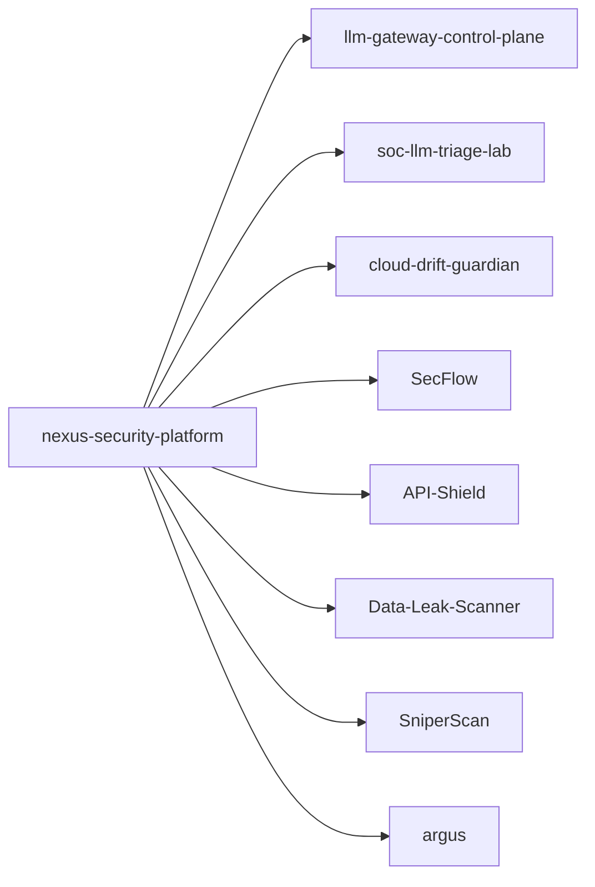

<h1 align="center">Ruslan T. | WaiperOK</h1>

Senior Security Engineering Portfolio: AI Security, SOC Automation, Cloud Posture, and Offensive Tooling

  
  
  

  
  
  
  
  

## Profile Summary
I build production-style security systems with deterministic logic, measurable quality gates, and release discipline.

This profile is organized as a platform ecosystem, not disconnected demos:
- 3 core anchors with architectural depth
- supporting satellites around those anchors
- shared contracts, CI standards, and docs conventions

## Flagship Anchors

| Project | Stack | Problem Solved | Proof of Engineering Quality |
|---|---|---|---|
| [llm-gateway-control-plane](https://github.com/WaiperOK/llm-gateway-control-plane) | Go | Multi-provider LLM gateway with policy, quota, and cost control | CI, integration tests, Docker stack, telemetry, threat model, releases |
| [soc-llm-triage-lab](https://github.com/WaiperOK/soc-llm-triage-lab) | Python | Deterministic SOC incident triage with retrieval and explainable output | API + CLI, tests, metrics, Docker compose, security docs, releases |
| [cloud-drift-guardian](https://github.com/WaiperOK/cloud-drift-guardian) | Rust | Desired-vs-actual cloud posture drift and risk scoring | Fast diff core, tests, reporting, API mode, telemetry, release cadence |

## Extended Portfolio Highlights

| Project | Role in Ecosystem |
|---|---|
| [nexus-security-platform](https://github.com/WaiperOK/nexus-security-platform) | Meta-repository connecting anchors, roadmap, and architecture map |
| [SecFlow](https://github.com/WaiperOK/SecFlow) | Multi-scanner DevSecOps orchestration framework with normalized findings |
| [API-Shield](https://github.com/WaiperOK/API-Shield) | Deterministic API posture scanner for AppSec pipelines |
| [Data-Leak-Scanner](https://github.com/WaiperOK/Data-Leak-Scanner) | Data leak detection engine for HTTP payloads, Burp, and CI usage |
| [SniperScan](https://github.com/WaiperOK/SniperScan) | High-concurrency TCP scanner with API mode and metrics |
| [argus](https://github.com/WaiperOK/argus) | Analyst-focused malware analysis workspace with deterministic risk scoring |
| [dsremaster-debuger](https://github.com/WaiperOK/dsremaster-debuger) | Runtime debug menu tooling with memory scan and bookmark workflows |
| [DSDebugCamera](https://github.com/WaiperOK/DSDebugCamera) | Debug-camera command core with tests and CI harness |

## Platform Architecture Map

## Engineering Quality Contract

Each serious repository is aligned to the same baseline:
- architecture document (`docs/ARCHITECTURE.md`)
- threat model (`docs/THREAT_MODEL.md`)
- security policy (`SECURITY.md`)
- CI workflow (`.github/workflows/ci.yml`)
- tagged releases + changelog
- runnable local quickstart

## Recent Upgrade Wave (February 2026)

| Repository | Latest Release | Major Improvements |
|---|---|---|
| [API-Shield](https://github.com/WaiperOK/API-Shield) | `v0.2.0` | Rebuilt as package, scanner engine, API, tests, CI, Docker |
| [Data-Leak-Scanner](https://github.com/WaiperOK/Data-Leak-Scanner) | `v0.2.0` | New detection core, entropy checks, Burp adapter, CI |
| [SniperScan](https://github.com/WaiperOK/SniperScan) | `v0.2.0` | Migrated to Go architecture with API + metrics |
| [SecFlow](https://github.com/WaiperOK/SecFlow) | `v1.1.0` | Import hardening, cache cleanup, modernized config, CI/docs |
| [argus](https://github.com/WaiperOK/argus) | `v0.2.0` | Strict quality gates, tests, deterministic risk scoring module |
| [DSDebugCamera](https://github.com/WaiperOK/DSDebugCamera) | `v0.2.0` | New command core, tests, CI, docs and release setup |
| [dsremaster-debuger](https://github.com/WaiperOK/dsremaster-debuger) | `v0.2.0` | Extended debug menu, bookmark flow, architecture docs |

## Primary Stack

| Domain | Technologies |
|---|---|
| Backend Core | Go, Python, Rust |
| Security Workloads | SAST, DAST, secret scanning, posture drift, policy engines |
| Platform Concerns | Auth, quotas, rate limits, audit, telemetry, CI/CD |
| Interfaces | CLI, HTTP APIs, web console |
| Packaging | Docker, Makefile workflows, release tags |

## How To Read This Portfolio

1. Start with [nexus-security-platform](https://github.com/WaiperOK/nexus-security-platform) for full map.
2. Review the 3 anchors for architecture depth.
3. Use satellites to evaluate breadth and implementation speed.
4. Check release history and CI badges for maintenance discipline.

## Current Focus

- AI-native security control planes with policy and cost governance
- SOC triage pipelines with explainable recommendations
- cloud drift and misconfiguration risk scoring
- production-grade repository standards for hiring visibility

## Contact

- GitHub: [@WaiperOK](https://github.com/WaiperOK)
- LinkedIn: [ruslan-t-05238721b](https://www.linkedin.com/in/ruslan-t-05238721b/)
- Hugging Face: [Waiper](https://huggingface.co/Waiper)
